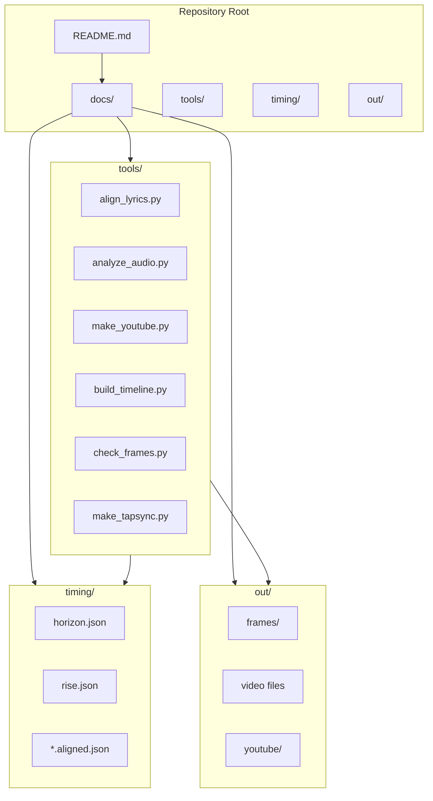

# Architecture Overview

```mermaid
flowchart TD
    subgraph RepoRoot[Repository Root]
        A[README.md]
        B[docs/]
        C[tools/]
        D[timing/]
        E[out/]
    end
    
    subgraph Tools[tools/]
        T1[align_lyrics.py]
        T2[analyze_audio.py]
        T3[make_youtube.py]
        T4[build_timeline.py]
        T5[check_frames.py]
        T6[make_tapsync.py]
    end
    
    subgraph Timing[timing/]
        Ti1[horizon.json]
        Ti2[rise.json]
        Ti3[*.aligned.json]
    end
    
    subgraph Output[out/]
        O1[frames/]
        O2[video files]
        O3[youtube/]
    end
    
    A --> B
    B --> Tools
    B --> Timing
    B --> Output
    Tools --> Timing
    Tools --> Output
```

The diagram illustrates the main directories and how the Python tools transform timing JSON files into rendered video assets.
