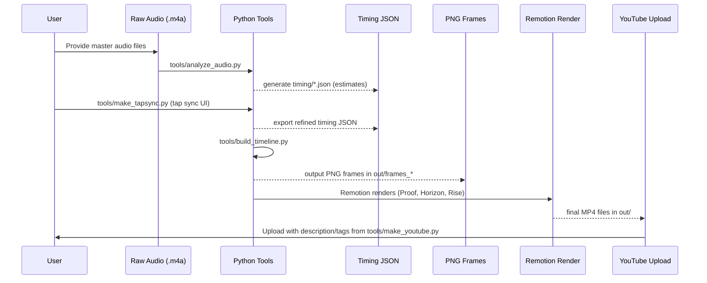

# Data Flow Diagram

```mermaid
sequenceDiagram
    participant User as User
    participant Audio as Raw Audio (.m4a)
    participant Tools as Python Tools
    participant Timing as Timing JSON
    participant Frames as PNG Frames
    participant Video as Remotion Render
    participant YouTube as YouTube Upload

    User->>Audio: Provide master audio files
    Audio->>Tools: tools/analyze_audio.py
    Tools-->>Timing: generate timing/*.json (estimates)
    User->>Tools: tools/make_tapsync.py (tap sync UI)
    Tools-->>Timing: export refined timing JSON
    Tools->>Tools: tools/build_timeline.py
    Tools-->>Frames: output PNG frames in out/frames_*
    Tools->>Video: Remotion renders (Proof, Horizon, Rise)
    Video-->>YouTube: final MP4 files in out/
    YouTube->>User: Upload with description/tags from tools/make_youtube.py
```

The diagram captures the main processing stages from audio assets through timing refinement, frame generation, video rendering, and final YouTube publication.
